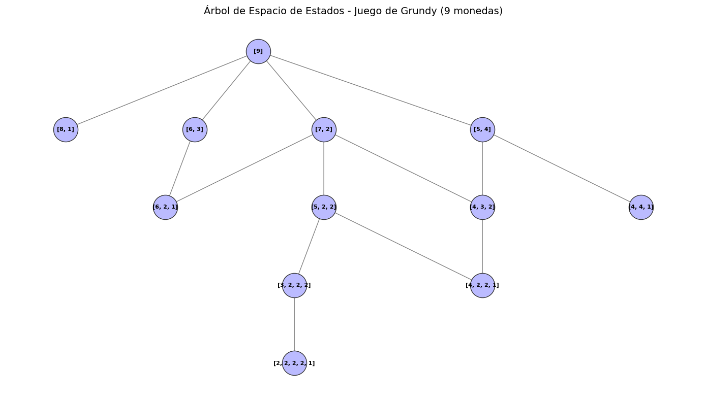

# 🌳 Grundy Game State Tree Solver

Implementación algorítmica y visualización en Python para el modelado del árbol de espacio de estados en el **Juego de Grundy** (Teoría de Juegos) utilizando grafos dirigidos.

## 📌 Descripción del Proyecto

Este script permite calcular recursivamente todos los movimientos válidos e identificar los estados posibles a partir de un conjunto inicial de elementos (e.g., un montón de monedas). Utiliza teoría de grafos para representar jerárquicamente las transiciones de estado, permitiendo analizar la dinámica del juego y calcular los valores de Grundy.

## 🚀 Características

- **Generación Algorítmica Recursiva:** Evaluación automática de divisiones en montones desiguales para estados impares.
- **Modelado en Grafos Dirigidos:** Construcción de la estructura jerárquica del juego mediante `NetworkX`.
- **Renderizado Visual:** Generación de diagramas jerárquicos y limpios del árbol de decisiones utilizando `Matplotlib`.
- **Estructura de Datos Única:** Uso de tuplas ordenadas para evitar nodos duplicados y representar estados unívocos.

## 🛠️ Tecnologías y Librerías

- **Python 3.x**
- **NetworkX:** Manejo y construcción de grafos dirigidos (`DiGraph`).
- **Matplotlib:** Visualización y renderizado gráfico del árbol de espacio de estados.
- **Graphviz / PyDot (Opcional):** Para el diseño de layout jerárquico (`dot`).

## 📊 Salida Visual

---
